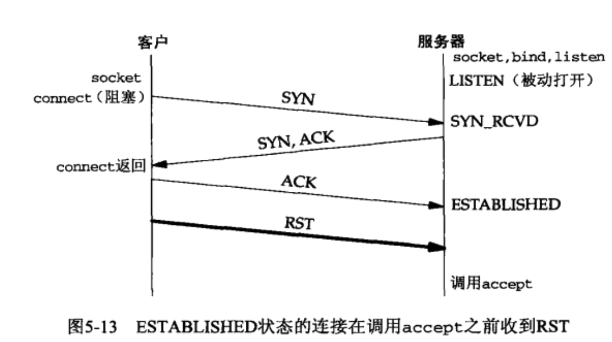
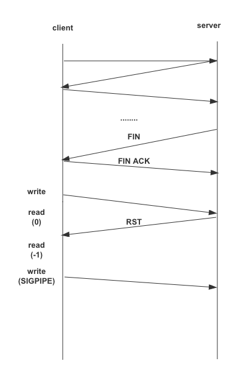

## 第4章
### 4.3 connect
connect出错情况
1. 没有收到SYN分节，多次尝试都没收到，返回ETIMEOUT（目的主机找不到）
2. 收到RST分节，返回ECONNREFUSED(主机能找到，倒是没有启动那个监听端口)
3. SYN在中间路由器引发目的地不可达的ICMP错误，内核暂时不上报进程，继续发送SYN分节，直到超时后，给进程返回EHOSTUNREACH或者ENETUNREACH
   
RST的三种情况
1. 客户端发送SYN，服务器没有对应的进程在监听那个端口
2. TCP取消一个已有连接
3. TCP接受到一个根本不存在的连接的分节

### 4.5 listen
```
listen(int sockfd, int backlog)
```
将一个主动套接字变成被动套接字
tcp为每个监听套接字设置两个队列
- 未完成连接队列，收到一个SYN借，就加入一个连接到该队列
- 已完成连接队列，完成三次握手后，加入该队列
- backlog现在的解释是已连接队列的最大值，而不是两个队列的和，后者可能会导致SYN泛滥攻击。
<!-- - 两个队列长度和不能超过**backlog** -->

如果未完成队列满时收到了SYN分节，服务器不会返回RST，而是让客户端超时重传SYN。因为如果发送了RST，那么客户端无法区分是主机没有监听还是未完成队列满了

### 4.6 accept
```
accept(int sockfd, struct sockaddr * cliaddr, socklen_t * addlen);
```
从连接队列取出一个连接并返回，参数可以获取客户端的套接字信息

## 第五章
### waitpid
```
waitpid(-1,&stat,WNOHANG);
```

### 系统中断
系统中断会导致慢系统调用被打断，中断结束后，系统调用一般会返回出错，出错码为EINTP

accept是其中一个例子,accept出错可以过滤终端错误，直接重试
另一个accept出错的情况是如下图

这种情况可以在客户端connect后直接设置SO_LINGER选项并退出程序即可。
SO_LINGER可以控制套接字关闭时的行为，具体是发送RST分节

### 服务器进程关闭的影响
如果服务器进程关闭，会发送FIN给客户端，客户端返回ACK，此时，TCP处于半关闭状态。此时客户端可以继续写数据，但是服务器会发送RST分节。此时若继续读，会报错，出错信息为"Connection reset by peer",具体如下图:


RST前面的read会返回eof，RST后面的RST返回出错,出错信息为："Connection reset by peer"。若收到RST后继续写，会收到SIGPIPE信号。

### 服务器主机崩溃
服务器崩溃后，客户端一般不会感知到，当客户端写数据，数据传入内核，内核TCP发送数据分节。此时服务器崩溃了，所以要么这个分节发送不到主机，要么中间路由键判定不可达，反正等不到ACK的到来。要么返回ETIMEOUT，要么返回EHOSTUNREACH或者ENETUNREACH。